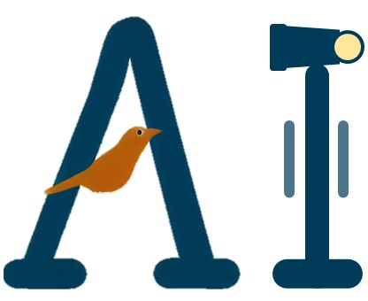
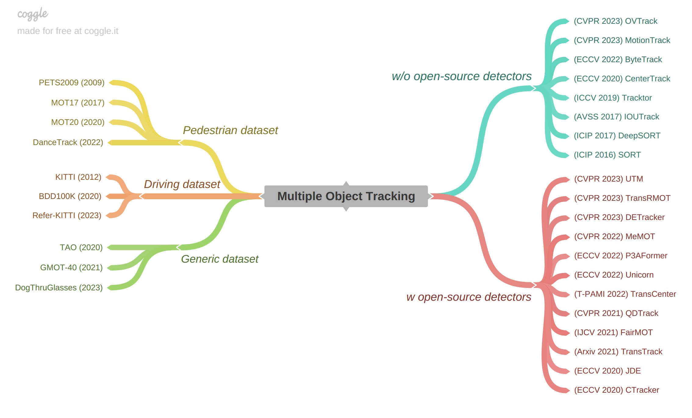

An introduction to AI methods for flying agents (birds, UAVs, etc.)

## 🧺 Table of Contents
- [🧺 Table of Contents](#-table-of-contents)
- [📰 News](#-news)
- [:bird: Bird flock](#bird-bird-flock)
- [📓 Related works](#-related-works)
  - [👬 Awesome multi-object tracking (MOT)](#-awesome-multi-object-tracking-mot)
  - [🏃 Awesome tracking any point (TAP)](#-awesome-tracking-any-point-tap)
  - [Others](#others)
- [📽️ Recommended resources](#️-recommended-resources)
- [🙏 Acknowledgement](#-acknowledgement)

## 📰 News
* 👀 (2023/07/08) A review paper on "Single object tracking (SOT) for UAV" has been accepted by Artificial Intelligence Review [<a href="https://arxiv.org/pdf/2205.04281.pdf">Paper</a>] [<a href="https://github.com/vision4robotics/SiameseTracking4UAV">Code</a>]. Don't miss it if you are interested in single object tracking on UAV platforms!

* 🚀 (2023/07/04) We present **SAM-DA** [[paper]](https://arxiv.org/abs/2307.01024) [[project]](https://github.com/vision4robotics/SAM-DA), a SAM-powered domain adaptation method for nighttime UAV tracking! With only **2.4** hours of training, the performance surpasses baseline with 12 hours of training, enabling the rapid deployment of nighttime UAV trakcing methods!
  
## :bird: Bird flock
* (*Nature communication*) Behavioural plasticity and the transition to order in jackdaw flocks. [[paper]](https://www.nature.com/articles/s41467-019-13281-4)
* (*Nature ecology & evolution*) Costs and benefits of social relationships in the collective motion of bird flocks. [[paper]](https://www.nature.com/articles/s41559-019-0891-5)

## 📓 Related works
### 👬 Awesome multi-object tracking (MOT)

<!--put a bird mot demo here-->

***

**2023**
* (2023 CVPR) Tracking Multiple Deformable Objects in Egocentric Videos. [[paper]](https://openaccess.thecvf.com/content/CVPR2023/html/Huang_Tracking_Multiple_Deformable_Objects_in_Egocentric_Videos_CVPR_2023_paper.html)[[project]](https://mingzhenhuang.com/projects/detracker.html)
    > New task: track multiple deformable objects using smart glasses. \
    > New dataset: DogThruGlasses, 150 videos and 73K annotated frames from smart glasses. 

* (2023 CVPR) Referring Multi-Object Tracking. [[paper]](https://openaccess.thecvf.com/content/CVPR2023/html/Wu_Referring_Multi-Object_Tracking_CVPR_2023_paper.html)[[project]](https://referringmot.github.io)
    > New task: employ a language expression as a semantic cue to track specific objects. \
    > New dataset: Refer-KITTI, 18 videos with 818 expressions. 

* (2023 CVPR) MotionTrack: Learning Robust Short-term and Long-term Motions for Multi-Object Tracking. [[paper]](https://openaccess.thecvf.com/content/CVPR2023/papers/Qin_MotionTrack_Learning_Robust_Short-Term_and_Long-Term_Motions_for_Multi-Object_Tracking_CVPR_2023_paper.pdf)
    > Task: associate detected objects between frames by modeling object motion with attention.  

* (2023 CVPR) UTM: A Unified Multiple Object Tracking Model with Identity-Aware Feature Enhancement. [[paper]](https://openaccess.thecvf.com/content/CVPR2023/papers/You_UTM_A_Unified_Multiple_Object_Tracking_Model_With_Identity-Aware_Feature_CVPR_2023_paper.pdf)
    > Task: associate detected objects between frames by modeling object motion with attention.  

* (2023 CVPR) OVTrack: Open-Vocabulary Multiple Object Tracking [[paper]](https://openaccess.thecvf.com/content/CVPR2023/papers/Li_OVTrack_Open-Vocabulary_Multiple_Object_Tracking_CVPR_2023_paper.pdf)[[code]](https://github.com/SysCV/ovtrack)
    > New task: open-vocabulary MOT, with vision-language models for classification and association and diffusion models for appearance learning. An interesting data hallucination strategy using Stable Diffusion for training data generation.

* (2023 arxiv) SparseTrack: Multi-Object Tracking by Performing Scene Decomposition based on Pseudo-Depth. [[paper]](https://arxiv.org/pdf/2306.05238.pdf)[[project]](https://github.com/hustvl/SparseTrack)
    > Task: combine identity learning with detection.

**2022**
* (2022 ECCV) ByteTrack: Multi-Object Tracking by Associating Every Detection Box. [[paper]](https://arxiv.org/abs/2110.06864)[[project]](https://github.com/ifzhang/ByteTrack)
    > Task: using YOLOX as a strong detector.
* (2022 ECCV) Tracking Objects as Pixel-wise Distributions. [[paper]](https://arxiv.org/abs/2207.05518)[[project]](https://github.com/dvlab-research/ECCV22-P3AFormer-Tracking-Objects-as-Pixel-wise-Distributions)
    > Task: propagates pixel-wise features guided by flow information to pass messages between frames.

### 🏃 Awesome tracking any point (TAP)

<!--put a bird tap demo here-->
<!--put a tap mind map here-->

* (2023 arxiv) CoTracker: It is Better to Track Together. [[paper]](https://arxiv.org/abs/2307.07635)[[project]](https://co-tracker.github.io/)
    > Task: jointly track multiple points throughout an entire video.

* (2023 arxiv) Segment Anything Meets Point Tracking. [[paper]](https://arxiv.org/abs/2307.01197)[[code]](https://github.com/SysCV/sam-pt)
    > Task: Zero-shot tracking and segmenting anything in dynamic videos, using SAM and PIPs.

* (2023 arxiv) Tracking Everything Everywhere All at Once. [[paper]](https://arxiv.org/abs/2306.05422)[[project]](https://omnimotion.github.io/)
    > New task: estimate dense and long-range motion from a video sequence during inference. 

* (2023 arxiv) TAPIR: Tracking Any Point with per-frame Initialization and temporal Refinement. [[paper]](https://arxiv.org/abs/2306.08637)[[project]](https://github.com/deepmind/tapnet)
    > New task: online and fast point tracking with matching and refinement.

* (2022 NeurIPS) TAP-Vid: A Benchmark for Tracking Any Point in a Video. [[paper]](https://arxiv.org/abs/2211.03726)[[code]](https://github.com/deepmind/tapnet)
    > New Task: tracking arbitrary physical points on surfaces over longer video clips. \
    New benchmark: TAP-Vid, with both real and synthetic videos, including 
    TAP-Vid-Kinetics, TAP-Vid-DAVIS, TAP-Vid-Kubric, and TAP-Vid-RGB-Stacking.

* (2022 ECCV oral) Particle Video Revisited: Tracking Through Occlusions Using Point Trajectories. [[paper]](https://arxiv.org/abs/2204.04153)[[code]](https://github.com/aharley/pips)
    > New Task: Long-range motion estimation using dense cost maps, iterative optimization, and learned appearance updates. 

### Others
* (2020 NeurIPS) Space-Time Correspondence as a Contrastive Random Walk. [[paper]](https://proceedings.neurips.cc/paper/2020/hash/e2ef524fbf3d9fe611d5a8e90fefdc9c-Abstract.html)[[project]](https://ajabri.github.io/videowalk/)
    > Task: obtain the correspondence of image patches by unsupervised learning from a palindrome sequence, where the query and target are the same. 

## 📽️ Recommended resources
* [Earthflight](https://www.amazon.co.uk/Earth-Flight-Season-1/dp/B00HXENBQG) -- BBC, 2011, 6 episodes.
    > "A British nature documentary that shows a flight from the view of the wings of birds across six continents, showing some of the world's greatest natural spectacles from a bird's-eye view. The BBC series was created by John Downer and narrated by David Tennant and consisted of six 60-minute episodes. The first episode aired on BBC One on 29 December 2011." -- from [Wikipedia](https://en.wikipedia.org/wiki/Earthflight)
* [IOC World Bird List](https://www.worldbirdnames.org/new/) -- International Ornithological Congress, updating
    > "The IOC World Bird List is an open access resource of the international community of ornithologists. Our primary goal is to facilitate worldwide communication in ornithology and conservation based on an up-to-date evolutionary classification of world birds and a set of English names that follow explicit guidelines for spelling and construction." --from [IOC World Bird List](https://www.worldbirdnames.org/new/)
    
## 🙏 Acknowledgement
* The icon is partly supported by [Stable Diffusion](https://stablediffusionweb.com/).
* Part of multi-object tracking section refers to [awesome-multiple-object-tracking](https://github.com/luanshiyinyang/awesome-multiple-object-tracking).
* The mind map of MOT is supported by [Coggle](https://coggle.it/).